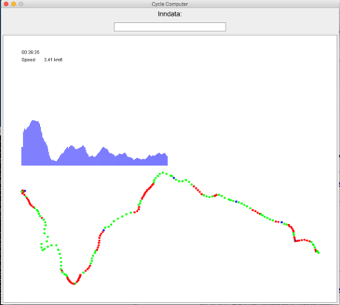

# DAT100 - Programmeringsprosjekt

Prosjektet handler om å utvikle programmer som kan gjøre beregninger og visualisere GPS (Global Positioning System) sensor data som bla. brukes i sykkelcomputere, sportsklokker og fitness-applikasjoner.

Dere vil få utlevert start-kode i form av et Eclipse-prosjekt som skal danne utgangspunkt for ulike Java programmer. I prosjektet skal dere jobbe i grupper med opptil 3 personer med å implementere de delene som mangler for at programmene blir komplett.

Dere vil også få utlevert et Eclipse-prosjekt med en del enhetstester (unit-tests) som skal brukes til automatisk å teste koden som dere implementerer. Enhetstestene er ikke komplette tester, men tester at de meste grunnleggende ting fungerer. Det er **viktig** å bruke disse testene underveis.

## Senk skuldrene

Java-programmeringen i prosjektet vil basere seg på det som er gjennomgått i faget frem til nå dvs. kapittel 1 til 6 i Java-boken. Det betyr at prosjektet også er tenkt som repetisjon og les gjerne i boken og se på videoene som ble lagt ut i forkant av undervisningen for å få bedre kontroll på de tema som vi har vært igjennom i faget. Det anbefales også å se på forelesningsnotatene fra forelesningen der programmeringsprosjektet blev introdusert.

Deler av prosjektet vil sannsynligvis oppleves som krevende for en del. Det gjelder i hovedsak om å jobbe seriøst med programmeringsoppgavene og få så mye til som dere klarer.

Det er **IKKE** lov å legge ferdige løsninger ut på Discord. 

## Uke 41 og uke 42 - Jobbe med programmeringsoppgaver

På programmerings-lab i uke 41 opg 42 skal dere jobbe med prosjektet. Her vil lab-assistenter være til stede for å hjelpe og svare på spørsmål relatert til programmeringsprosjektet. I uke 41 er der **ikke** forelesning på torsdagen og i uke 42 er der ikke forelesning på onsdagen. Dette for å gi mer tid til å jobbe med projektet.

## Uke 42 og uke 43 - Gruppemøter

I uke 42 eller uke 43 (avhengig av hvor rask gruppen kommer i mål med oppgavene) skal hver gruppe møtes med 1-2 andre grupper for å diskutere og sammenligne løsningene som dere er kommet frem til. Dere kan gå frem oppgave for oppgave. Om der er ting som gruppene ikke fikk til å fungere, kan dette også diskuteres som en del av møtet. 

Informasjon om hvordan gruppemøtene organiseres kommer på Canvas.

## GPS data og mål med prosjektet

Mange sykkelcomputere, sportsklokker og fitness-applikasjoner bruker GPS data dvs. informasjon om bla. tid og posisjon for å beregne statistikk som distanse, hastighet, høydemeter og til å visualisere rute og høydeprofil. Dette gjøres i programkode på enheten.

### Formål

Formålet med prosjektet er å implementere Java-programmer som har tilsvarende funksjonalitet som en typisk sykkelcomputer. Avanserte sykkelcomputere gjør beregninger løpende basert på input data fra en GPS sensor. Java-programmene i dette prosjektet baseres på å lese GPS data fra en datafil. På den måten vil Java-programmet simulere en riktig sykkelcomputer og fungere som en slags virtuell (ikke fysisk) sykkelcomputer.

Det ultimative målet med prosjektet er en Java-applikasjon som bruker EasyGraphics biblioteket til løpende (live) å gi syklisten (brukeren) informasjon svarende til det som er skissert på bildet nedenfor. Her er tid og aktuell hastighet vist i øverste venstre hjørne og høydeprofilen er i midten. Videre er ruten tegnet på et kart nederst der rød angir at sykkelruten går oppover, grønn at det går nedover og blå at det er flatt.



### GPS data format

Der finnes ulike formater som kan brukes til å lagre GPS data. I dette prosjektet skal vi ta utgangspunkt i tekstfiler som bruker en variant av *CSV* formatet (Comma-Separated-Values). Dette betyr at en datafil med eksempelvis fem GPS datapunkter representeres på følgende måte:

```
5
time,lat,lon,elevation,accuracy,bearing,speed,satellites,provider,
2017-08-13T08:52:26.000Z,60.385390,5.217217,61.9,7.0,219.93,0.94605947,0,gps
2017-08-13T08:53:00.000Z,60.385588,5.217857,56.2,11.1,0.0,0.0,0,gps
2017-08-13T08:53:57.000Z,60.385398,5.216950,56.1,10.5,0.0,0.0,0,gps
2017-08-13T08:55:55.000Z,60.383428,5.219823,57.0,5.8,143.5,4.989717,0,gps
2017-08-13T08:57:57.000Z,60.376988,5.227082,105.5,5.2,159.61,9.415813,0,gps,
```

Den første linjen inneholder et heltall (her 5) som angir hvor mange GPS datapunkter som finnes i filen. Linje 2 gir (meta)-informasjon om hvordan de etterfølgende linjer (selve GPS datapunktene) med verdier oppdelt med komma skal tolkes (betyr). Her kan vi se at først kommer informasjon om tid (time), så breddegrad (engelsk: latitude), så lengdegrad (engelsk: longitude), så høyde (engelsk: elevation), så nøyaktighet (engelsk: accuracy) osv.  

Som eksempel har vi for det første GPS datapunkt (i linje 3 i filen) informasjonen at datoen var 13. august 2017 kl. 8:52:26, breddegraden var 60.305390 grader (nord pga. gradtallet er positivt) og lengdegraden var 5.217217 grader (øst pga. gradtallet er positivt). Høyden var 61.9 meter.

Datafilen forteller altså hvilke punkter vi har flyttet oss igjennom og til hvilket tidspunkt. Vi startet i punktet svarende til linje 3, så flyttet vi oss til punktet i linje 4 osv. Totalt sett har vi beveget oss gjennom fem punkter som da definerer den ruten vi har syklet.

I oppgaven skal dere bruke større GPS datafiler bla. en datafil der en DAT100 underviser har vært ute og sykle på ulike deler av løypene fra VM i Bergen, 2017. GPS log-filene finnes i mappen `logs` i startkoden.

Der finnes også ulike appplikasjoner eks. på web der filer med GPS data kan visualieres. Eksempelvis: https://gpx.pelmers.com/

## Oppgaver

- [**Oppgave 0:** Hente startkoden og registrere gruppe oppbevaringsplass på GitHub](https://github.com/dat100hib/dat100-prosjekt-gps-testing/blob/master/docs/oppgave0.md)
- [**Oppgave 1:** GPS punkter og klasser](https://github.com/dat100hib/dat100-prosjekt-gps-testing/blob/master/docs/oppgave1.md)
- [**Oppgave 2:** Datakonvertering og referansetabeller](https://github.com/dat100hib/dat100-prosjekt-gps-testing/blob/master/docs/oppgave2.md)
- [**Oppgave 3:** Hjelpemetoder for tabeller og beregninger](https://github.com/dat100hib/dat100-prosjekt-gps-testing/blob/master/docs/oppgave3.md)
- [**Oppgave 4:** GPS data beregninger](https://github.com/dat100hib/dat100-prosjekt-gps-testing/blob/master/docs/oppgave4.md)
- [**Oppgave 5:** Visualisering og EasyGraphics](https://github.com/dat100hib/dat100-prosjekt-gps-testing/blob/master/docs/oppgave5.md)
- [**Oppgave 6:** Valgfrie ekstraoppgaver](https://github.com/dat100hib/dat100-prosjekt-gps-testing/blob/master/docs/oppgave6.md)
