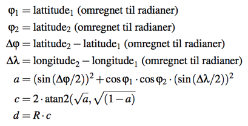

### Oppgave 3 - GPS hjelpemetoder

I denne oppgaven skal det implementeres noen hjelpe-metoder i klassen `GPSUtils.java` som vi skal bruke seinere i prosjektet til å gjøre beregninger på de GPS datapunktene som blir lest inn og lagret via metodene og klassene implementert i oppgave 2.

Denne oppgaven består i å gjøre ferdig implementasjonen av metodene nedenfor i klassen `GPSUtils.java` og bruke enhetstestene i klassen `GPSUtilsTester.java` til løpende å teste koden.

*For denne oppgaven er spesielt Kap 5.1-5.3, 5.5-5.6 i Java-boken samt Undervisning 8 relevant*

#### a)

Implementer metoden

```java
double findMin(double[] da)
```

som finner minste tall i en tabell med flyttall. Det kan antas at der er minst et element i tabellen. **Hint:** se på implementasjonen av metoden `findMax` som allerede finnes i klassen.

#### b)

Implementer metoden

```java
public static double[] getLatitudes(GPSPoint[] gpspoints)
```

som tar en tabell med GPS punkter som parameter og returnerer en tabell av desimaltall inneholdende breddegradene for GPS-punktene.

**Hint:** metoden skal først opprette en tabell av desimaltall med samme lengde som `gpspoints`-tabellen og så kopiere de enkelte breddegrader over i den nye tabellen. Husk at `getLatitude`-metoden på et `GPSPoint`-objekt kan brukes til å lese ut breddegrad i et objekt.   

#### c)

Implementer metoden

```java
public static double[] getLongitudes(GPSPoint[] gpspoints)
```

som er tilsvarende `getLatitudes`-metoden ovenfor, men for lengdegrader.

#### d)

Implementer metoden

```java
public static double distance(GPSPoint gpspoint1, GPSPoint gpspoint2)
```

som beregner og returnerer avstanden *d* i meter mellom to GPS punkt på jord-kloden ved bruk av Haversine-formlen



der *R = 6 371 000* m er jordens gjennomsnittsradius.

De to GPS punktene i formelen ovenfor er (latitude<sub>1</sub>, longtitude<sub>1</sub>) og (latitude<sub>2</sub>, longtitude<sub>2</sub>). Teksten *omregnet til radianer* i figuren betyr at etter å ha utregnet verdien av uttrykket til høyre for `=`-tegnet (eks. *longitude<sub>2</sub> - longitude<sub>2</sub>*) skal resultatet omregnes til radianer.

Start-koden for klassen inneholder to lokale hjelpemetoder:

```java
private static double compute_a(double phi1, double phi2, double deltaphi, double deltadelta)
private static double compute_c(double a)
```
der det er tenkt å gjøre beregningen av henholdsvis *a* og *c* i formlen.

**Hint:** Math-klassen: https://docs.oracle.com/en/java/javase/11/docs/api/java.base/java/lang/Math.html inneholder de metoder som trengs inkl. `atan2`. Metoden `toRadians` i Math-klassen kan brukes til å omregne (lengde/bredde) grader til radianer.

#### e)

Implementer metoden

```java
public static double speed(GPSPoint gpspoint1, GPSPoint gpspoint2) {
```

som beregninger gjennomsnittshastighet i *m/s* om man beveger seg fra punktet gitt ved `gpspoint1` til punktet `gpspoint2`.

**Hint:** Bruk metoden `distance` fra d) samt get-metode(r) på `GPSPoint`-objekt.

#### f)

Implementer metoden

```java
public static String formatTime(int secs)
```

som returnerer en streng på formatet `hh:mm:ss` der tiden i sekunder fra midnatt er gitt av parameteren `secs`. I strengen på formatet `hh:mm:ss`  er `hh` antall timer, `mm` er antall minutter og `ss` er antall sekunder. Videre skal metoden legge inn mellomrom foran tiden slik den total lengden på strengen blir 10. 

Hvis eksempelvis `secs` er `10921` da skal metoden returnere strengen:

```
"  03:02:01"
```

**Hint:** Bruk nettressurser for å finne informasjon om `format`-metoden i `String`-klassen. Modulo operatoren `%` kan brukes til å få rest ved divisjon i Java.

#### g)

Implementer metoden

```java
public static String formatDouble(double d)
```

som runder av et flyttall til to desimaler, setter resultat inn i en streng og fyller på med mellomrom foran i strengen slik at totallengden på strengen blir 10. Det kan antas at tallet maksimalt trenger 10 karakterer.

Hvis eksempelvis `d` er `1.346` da skal metoden returnere strengen:

```
"      1.35"
```