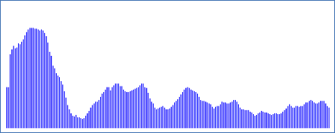

### Oppgave 5 - Visualisering

I denne oppgaven skal EasyGraphics-biblioteket brukes til å visualisere høydeprofil, hastighet og rute.

Dokumentasjon for metodene i EasyGraphics-bibliotekt kan finnes her https://dbsys.info/programmering/easygraphics/javadoc/index.html

Der er ingen test-klasse for metoden i denne oppgaven, men der kan kjøre programmene og se at visualiseringen ser riktig ut.

##### a) Høydeprofil

I denne oppgaven skal høyde-kurven for ruten gitt ved GPS datapunktene visualieres.

For GPS datafilen `medium` skal visualiseringen se ut som nedenfor der høyden på en vertikal linje svarer til høyden i GPS datapunktet.



I klassen `showProfile.java` finnes allerede en `main`- og `run`-metode som setter opp et vindu som kan brukes til å tegne høydeprofilen og som ber brukeren om navn på den gps-datafil som skal visualiseres (short, medium, long, vm).

Klassen sørger allerede for å lese inn data fra GPS datafilen ved oppstart og lagre GPS data i en tabell `gpspoints` med GPS punkter:

```java
private GPSPoint[] gpspoints;
```

Denne tabellen skal dere bruke for å implementere metoden: 

```java
showHeightProfile(int ybase)
```

som tegner høydeprofilen der parameteren `ybase` angir hvor på y-aksen bunnen av søylene skal starte.

For å gjøre oppgaven enklere kan det antas at hvert punkt (pixel) i vinduet svarer til en høyde-meter. Eventuelt negative høyder skal ignoreres – dvs. behandles som om de hadde verdien 0.

**Hint:** Bruk en løkke for å iterere igjennom alle punktene og oppdater start (x,ybase)-punkt og slutt (x,y)-punkt for linjer som kan tegnes med `drawLine`-metoden i EasyGraphics. Den symbolske konstanten `MARGIN` i klassen angir hvor på x-aksen den først vertikale linjen skal tegnes og hvor høyde-linjen skal starte på y-aksen.

##### b) Hastighet

I denne oppgaven skal hastigheten der blev kjørt med i løpet av ruten visualiseres. For GPS datafilen `medium` skal visualiseringen se slik ut


der den grønne linjen indikerer gjennomsnittshastigheten for hele ruten. Hasigheter og gjennomsnitshastigheter skal vises som km/t.

Ferdiggjør implementasjonen av metoden `showSpeedProfile` i klassen `ShowSpeed.java`

Der finnes allerede en `main` og `run`-metode i klassen som setter opp vindu og som kaller metoden `showSpeedProfile`. GPS data blir automatisk lest inn i et i konstruktøren i klassen som setter opp `GPSComputer`-objektet `gpscomputer`. Bruk metoder fra oppgave 4 på dette objektet til å få tilgang til hastigheter og gjennomsnittshastigheter.

##### c) Sykkelruten

I denne oppgaven ruten visualieres på et kart og til slutt skrive ut statistikk (nøkkeltall) om sykkelturen i øverste venstre hjørne. Et eksempel er vist nedenfor for log filen `medium`


der y-aksen svarer til breddegrader og x-aksen svarer til lengdegrader.

Ferdiggjør implementasjonen av metodene i klassen `ShowRoute.java`. Der finnes allerede en `main`-metode i klassen som setter opp vindu og som kaller de tre metodene `showRouteMap`, `showStatistics` og `replayRoute`. 

Konstruktøren i klassen oppretter også et `GPSComputer`-objekt `gpscomputer` som kan brukes til å beregne nøkkeltall med samt en tabell `gpspoints` som inneholder GPS punkter på ruten.

Metoden `run` beregner `xstep` som angir hvor mange punkter (Easygraphics pixels) en lengdegrad skal svare til for at vi kan tegne alle GPS datapunkter innen for et tegneområde på skjermen med et antall punkter i x-retningen som er gitt ved konstanten `MAPXSIZE`. Tilsvarende beregner metoden `ystep` som angir hvor mange punkter (Easygraphics pixels) en breddegrad skal svare til for at vi kan tegne alle GPS datapunkter innen for et tegneområde på skjermen med et antall punkter i y-retningen som er gitt ved konstanten `MAPYSIZE`.

Implementer metoden

```java
showRouteMap(int ybase)
```

som tegner punkter i vinduet svarende til de (lengdegrad,breddegrad) posisjone/punkter som finnes i GPS datafilen. Parameteren `ybase` angir det sted på y-aksen som skal svare til den minste breddegrad som finnes i `gpspoints` og som er lest inn fra datafilen.

Implementer metoden
```java
public void showStatistics()
```

som viser statistikk fra sykkelturen i øverste venstre hjørne (se bildet først i oppgaven ovenfor).

**Hint:** Easygraphics-metoden `drawString` kan brukes til å "tegne" en streng i vinduet. Metodene på objektet `gspcomputer` inne i klassen kan brukes til å finne de nøkkeltall som skal vises som del av statistikken.

Implementer metoden

```java
public void replayRoute(int ybase)
```

som flytter en blå sirkel langs ruten. 

**Hint:** Easygraphics metoden `moveCircle`og `setSpeed` kan  brukes til henholdsvis å få en sirkel til å bevege seg til et punkt og sette hastighet for bevegelsen.
